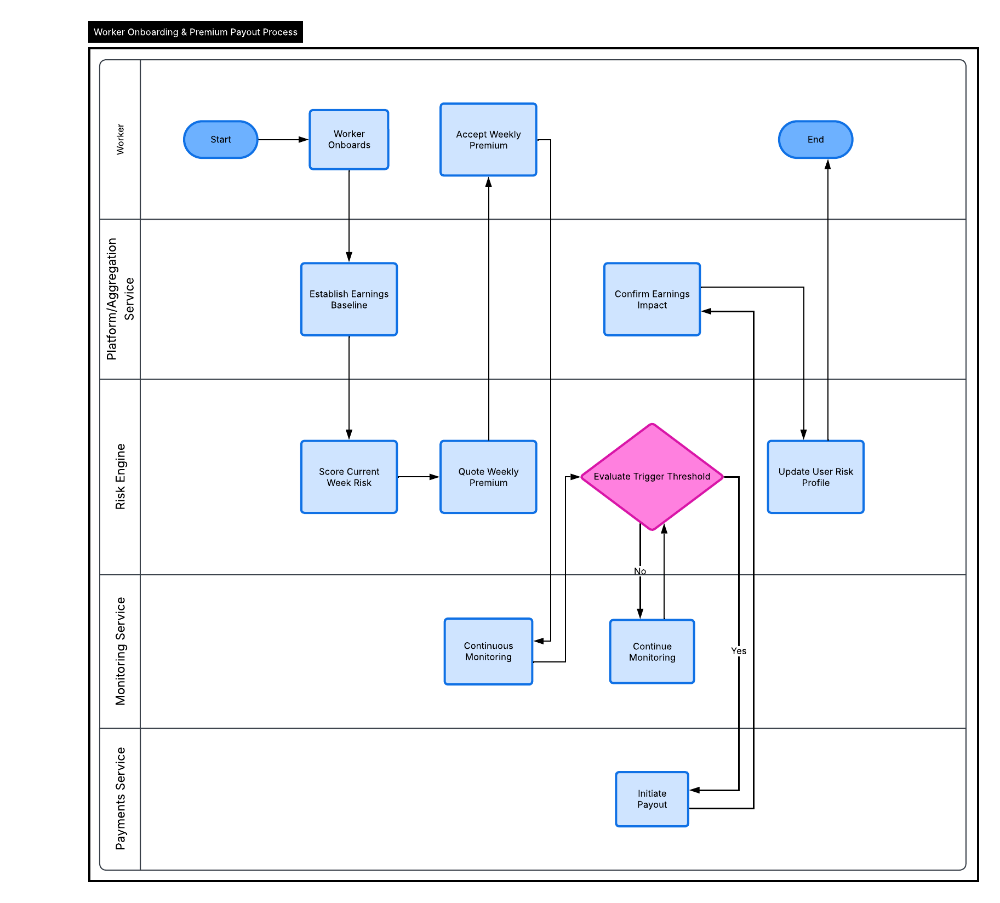

# ShieldRide: AI-Powered Parametric Income Protection for Quick-Commerce Delivery Workers

---

## Table of Contents

1. [The Problem](#1-the-problem)
2. [User Persona and Scenario](#2-user-persona-and-scenario)
3. [Solution Overview](#3-solution-overview)
4. [Key Innovations and USP](#4-key-innovations-and-usp)
5. [System Architecture](#5-system-architecture)
6. [AI/ML Integration](#6-aiml-integration)
7. [Pricing Model](#7-pricing-model)
8. [Pricing Architecture](#8-pricing-architecture)
9. [Parametric Triggers](#9-parametric-triggers)
10. [Fraud Detection](#10-fraud-detection)
11. [Tech Stack](#11-tech-stack)
12. [User Flow](#12-user-flow)
13. [Dashboard Features](#13-dashboard-features)
14. [Future Scope](#14-future-scope)

---

## 1. The Problem

Rajan earns his living delivering for Blinkit in Bengaluru. On a clear day he makes Rs. 700. When the monsoon hits, he might make Rs. 120 — sitting under a flyover, watching earnings collapse with nothing to fall back on. No sick leave. No paid time off. No insurance that covers this.

Hundreds of thousands of gig delivery workers face this structural vulnerability every week. Their income is directly tied to conditions they cannot control: rainfall, AQI spikes, localized zone shutdowns, and sudden demand collapses. Unlike salaried workers, they have no employer buffer. Unlike farmers, they have no government scheme designed for them.

**Core gaps in the current system**:
- Earnings vary 40–60% week to week due to external disruptions, not lack of effort
- No insurance product addresses income loss from environmental or operational disruptions
- Workers operating across multiple platforms have no unified income view or coverage
- Lack of formal income documentation excludes them from mainstream financial safety nets

---

## 2. User Persona and Scenario

**Rajan, 29 — Delivery Executive, Bengaluru**  
Platforms: Blinkit (primary) + Zepto (secondary) | Weekly earnings: Rs. 4,800–5,600 | Dependents: Wife, one child | Savings buffer: 3–5 days

**Daily workflow**: Active 6:30 AM–9 PM, chasing peak incentive windows across two platforms. Switches between apps based on surge availability. Has no guaranteed minimum daily income.

**Pain points**:
- Cannot predict or plan for bad weeks caused by rain, AQI advisories, or zone-level restrictions
- Earnings from two platforms means no single app shows his true income or total exposure
- Traditional insurance products are designed for salaried workers — irrelevant to his situation
- Has no formal documentation of income to prove loss to any institution

**Scenario**: Week three of July. AQI in Delhi crosses 350; municipal advisories restrict outdoor movement 12–4 PM. Dark stores in Rajan's zone suspend dispatch. His effective delivery window shrinks by four hours. Weekly income drops to Rs. 2,900 — 45% below his average.

With ShieldRide, Rajan had purchased a weekly protection plan 48 hours prior, when the system flagged elevated disruption probability from AQI forecasts. By Thursday, earnings impact data confirmed the shortfall, and Rs. 1,800 was transferred to his UPI account automatically. No claim form. No phone call. No documentation required.

---

## 3. Solution Overview

ShieldRide is an AI-powered parametric income protection platform built exclusively for quick-commerce delivery workers. It automatically pays out when verifiable external disruptions — weather, AQI, zone shutdowns, or demand collapse — reduce a worker's earnings below their established baseline.

- **Parametric**: Payouts are triggered automatically when pre-defined, measurable conditions are met. There is no manual claims process. The system monitors conditions continuously and acts independently.
- **AI-Powered**: Risk scoring, earnings baseline estimation, disruption prediction, fraud detection, and behavioral recommendations are all model-driven.
- **Platform-Agnostic**: Coverage is computed from aggregated earnings across all platforms the worker operates on — Blinkit, Zepto, Swiggy Instamart, BigBasket Now — not just one.
- **Weekly**: Plans are priced and renewed every week, making them accessible and aligned with how gig workers earn and plan.
- **Income-Only**: Coverage is strictly limited to income loss from operational disruptions. Health, accident, and vehicle coverage are explicitly out of scope.

**System flow**:
```
Onboarding → Earnings Baseline → Risk Scoring → Premium Quote → Policy Active
     → Continuous Monitoring → Trigger Evaluation → Payout → Feedback Loop
```

---

## 4. Key Innovations and USP

### 4.1 Platform-Agnostic Income Protection

**What it is**: Most gig workers in India today earn across two or three platforms simultaneously. Coverage tied to a single platform misses a large fraction of the worker's real income. ShieldRide aggregates earnings across every platform the worker operates on, computing coverage against their true total income — not a partial slice of it.

**How it works**: During onboarding, workers declare all active platforms and provide earnings evidence (screenshots, export files, or stated averages). The system builds a unified multi-platform earnings baseline, which is updated each week using declared activity data. All pricing, payout calculations, and risk assessments are based on this aggregated figure. Workers do not need to purchase separate coverage per platform — one ShieldRide plan covers everything.

**Why it matters**: A worker earning Rs. 2,800 from Blinkit and Rs. 2,000 from Zepto has a real weekly income of Rs. 4,800. A single-platform product covers at most Rs. 2,800 — leaving 42% of their income completely unprotected. ShieldRide closes this gap entirely. This also means that if one platform reduces orders during a disruption while another continues partially, the system accounts for the combined net impact rather than evaluating platforms in isolation.

---

### 4.2 Peer-Based Risk Intelligence

**What it is**: Individual data on any single worker is limited and noisy. But when a disruption hits — heavy rain, a zone shutdown, a sudden demand collapse — it affects dozens or hundreds of workers in the same area simultaneously. ShieldRide uses the collective, anonymized activity patterns of nearby enrolled workers as a real-time disruption detection signal that is faster, more localized, and more actionable than any external data source alone.

**How it works**: The system continuously tracks aggregated delivery metrics by zone in rolling 5–30 minute windows: order acceptance rates, active worker count, average delivery speed, and inter-delivery gap times. These metrics are compared against that zone's historical baseline for the same time window using a rolling z-score model. When zone-level metrics drop more than 1.8 standard deviations below baseline, a peer disruption signal is raised. Three consecutive flagged windows within a 90-minute period escalate the zone to trigger-ready status — meaning a payout can be activated even before an external API confirms the event.

**Why it matters**: Weather APIs report city-wide or district-wide conditions with a 15–30 minute lag. Official AQI feeds update every hour. A flooded alley that stops 25 workers in a 400-meter radius shows up in peer data within minutes, long before any external source registers the disruption. This makes ShieldRide's trigger system faster, more hyperlocal, and significantly harder to game than systems that rely purely on external data. It also creates a self-improving network effect: the more workers enroll in a zone, the more accurate and granular the peer signal becomes.

---

### 4.3 Behavioral Incentive Engine

**What it is**: Workers who act on AI-generated recommendations — shifting zones ahead of a weather event, front-loading their shift to avoid a forecasted disruption window, or avoiding high-risk time slots — demonstrate lower income volatility and generate fewer payout events for the platform. ShieldRide rewards this behavior directly through premium discounts, improved coverage tiers, and early warning access, creating a product that actively helps workers earn more rather than simply compensating them after the fact.

**How it works**: Every week, the AI generates a personalized behavioral recommendation for each worker based on their zone's predicted risk profile and the worker's historical patterns. Examples: "Shift your Tuesday afternoon window to morning — AQI forecast is elevated after 2 PM" or "Zone 4 has 70% disruption probability Wednesday; Zone 7 is safer." Compliance with these recommendations is verified through GPS data and activity logs. Each verified compliance event earns a "compliance point" that contributes to the worker's Behavioral Score (0–100). The Behavioral Score from the prior week directly determines the discount applied to the next week's premium, as shown in the pricing model.

Workers with consistently high Behavioral Scores also gain access to enhanced benefits: priority payout processing, access to a higher coverage tier, and early-alert notifications that give them a 30–60 minute head start before a disruption triggers.

**Why it matters**: This transforms ShieldRide from a passive financial product into an active income-optimization tool. Workers are financially incentivized to make smarter operational decisions, which simultaneously reduces their own income volatility and reduces the platform's payout liability. The result is a self-reinforcing loop: informed workers earn more consistently, cost the platform less in payouts, and pay lower premiums over time. It is a genuine alignment of incentives between the worker and the insurer — rare in the insurance industry.

---

## 5. System Architecture

```
+------------------+       +---------------------+
|  Worker Frontend |       |   Admin Dashboard   |
|  (Next.js / PWA) |       |   (React + Charts)  |
+--------+---------+       +---------+-----------+
         |                           |
         v                           v
+-----------------------------------------------+
|         API Gateway (Node.js / Express)        |
|   Auth | Rate Limiting | Request Routing       |
+---+----------+----------+----------+-----------+
    |          |          |          |
    v          v          v          v
+-------+ +--------+ +--------+ +----------+
| User  | | Policy | | Risk   | | Trigger  |
| Svc   | | Engine | | Engine | | Engine   |
+-------+ +--------+ +---+----+ +----+-----+
                          |           |
                          v           v
              +----------------+  +----------------+
              | AI/ML Service  |  | Payout Service |
              | (Python/FastAPI)|  | (Razorpay Mock)|
              +---+---+---+----+  +----------------+
                  |   |   |
          +-------+   |   +-------+
          v           v           v
    +----------+ +----------+ +----------+
    | Risk     | | Earnings | | Fraud    |
    | Predictor| | Estimator| | Detector |
    +----------+ +----------+ +----------+
                      |
                      v
+-----------------------------------------------+
|            External Data Layer                |
|  Weather API | AQI | Zone Data | Peer Signals |
+-----------------------------------------------+
                      |
                      v
+-----------------------------------------------+
|              Database Layer                   |
|  PostgreSQL (policies, payouts, users)        |
|  Redis (peer signals, trigger state, cache)   |
+-----------------------------------------------+
```

**Data flow**:
1. Worker onboards via frontend; API Gateway routes profile data to User Service and initial risk scoring
2. AI/ML Service produces risk score, earnings baseline, and 7-day disruption probability
3. Policy Engine computes weekly premium; worker reviews and pays via UPI (simulated)
4. Trigger Engine polls weather API, AQI feed, zone status, and peer signals every 30 minutes during active hours
5. On threshold breach, Fraud Engine runs GPS and activity validation; Payout Service initiates UPI transfer
6. Post-payout outcomes and behavioral compliance data feed back into the risk model and worker profile

---

## 6. AI/ML Integration

### Risk Prediction Model
**Goal**: Estimate the probability that a worker in a given zone will face income disruption in the upcoming week.  
**Inputs**: Historical weekly earnings volatility, 7-day weather forecast, AQI trajectory, zone restriction history, day-of-week patterns, seasonal factors.  
**Model**: XGBoost classifier trained on synthetic disruption-earnings data augmented with public weather event records. Outputs a disruption probability (0.0–1.0) that feeds directly into the pricing formula.

### Earnings Impact Estimator
**Goal**: Given a disruption, estimate how many delivery hours will be lost and what the rupee shortfall will be.  
**Inputs**: Worker's historical hourly earnings by time slot, disruption type and intensity, zone-level historical impact data, peer activity drop percentage during similar events.  
**Model**: Linear regression with interaction terms (disruption intensity × zone sensitivity × time-of-day). Recalibrated weekly against realized payouts to maintain accuracy.

### Fraud Detector
**Goal**: Prevent gaming of the parametric trigger system.  
**Approach**: A two-layer system — rule-based filters for clear violations (GPS mismatch, activity-during-claim) and an Isolation Forest model for subtle adverse selection patterns such as consistently buying policies only before high-probability events.

### Peer Signal Processor
**Goal**: Convert collective zone-level activity data into real-time disruption signals.  
**Approach**: Rolling z-score model on 5–30 minute activity windows per zone. A drop exceeding 1.8 standard deviations below the zone's time-adjusted historical baseline raises a peer signal. Three consecutive signals within 90 minutes escalate to trigger-ready status.

---

## 7. Pricing Model

### Core Formula

**Weekly Premium = (E_h × L_h × R) + F − D**

Where E_h = Avg Hourly Earnings, L_h = Expected Lost Hours, R = Risk Score, F = Platform Fee, D = Behavioral Discount.

The formula ensures the premium is directly proportional to the worker's earnings stake in the upcoming week, scaled by the probability and likely severity of a disruption, and adjusted for individual risk behavior.

---

### Variable Definitions

**Avg Hourly Earnings (E_h)**

The worker's average earnings per active delivery hour, aggregated across all platforms over the trailing 4 weeks. Outlier weeks (more than 2 standard deviations from the worker's historical mean) are excluded to prevent single anomalous weeks from distorting the baseline.

> E_h = Total Earnings (past 4 weeks) / Total Active Delivery Hours (past 4 weeks)

For new workers with no history, the system uses the zone-level median E_h as the starting estimate, updated after the first completed week.

---

**Expected Lost Hours (L_h)**

The number of productive delivery hours estimated to be lost in the upcoming week due to disruption. This is derived from the AI model's disruption probability output and the zone's historical average disruption duration.

> L_h = Disruption Probability × Avg Disruption Duration (hrs) × Active Weekly Hours Fraction

- **Disruption Probability**: Output of the Risk Prediction Model (0.0–1.0)
- **Avg Disruption Duration**: Zone-level historical average hours lost per disruption event (pulled from the past 90 days)
- **Active Weekly Hours Fraction**: The proportion of the worker's typical weekly hours that fall within high-disruption time windows (e.g., monsoon afternoons), so that only vulnerable hours contribute to the exposure estimate

---

**Risk Score (R)**

A composite multiplier between 0.5 and 1.5 that scales the premium based on zone conditions and forecast severity. A score of 1.0 represents average risk.

> R = Base Zone Risk × Weather Intensity Multiplier × Seasonal Adjustment

| Component | Range | Example Values |
|---|---|---|
| Base Zone Risk | 0.8–1.2 | Low-disruption zone: 0.85 / Flood-prone zone: 1.15 |
| Weather Intensity Multiplier | 1.0–1.3 | Normal forecast: 1.0 / Heavy rain forecast: 1.2 / Cyclone warning: 1.3 |
| Seasonal Adjustment | 0.95–1.1 | Summer (low risk): 0.95 / Monsoon season: 1.1 / Winter fog (north): 1.05 |

---

**Platform Fee (F)**

A fixed operational fee of Rs. 15 per weekly policy, covering platform infrastructure costs. Not risk-adjusted and does not affect coverage amount.

---

**Behavioral Discount (D)**

A premium reduction tied to the worker's Behavioral Score from the prior week, calculated as:

> D = Pre-discount Premium × Discount Rate

| Behavioral Score | Discount Rate | Description |
|---|---|---|
| 0–40 | 0% | No compliance with AI recommendations |
| 41–60 | 5% | Occasional compliance |
| 61–80 | 10% | Consistent compliance |
| 81–100 | 15% | Strong compliance, low-risk behavior |

The Behavioral Score is computed from recommendation compliance rate, GPS zone consistency, and platform activity regularity. It resets partially each week (80% carry-forward + 20% from new activity), so recent behavior always matters.

---

### Supporting Formulas

**Expected Weekly Loss** — the maximum payout a worker can receive in a triggered week:

> Expected Weekly Loss = E_h × L_h

Actual payouts are calculated as the verified earnings shortfall for the trigger window, capped at this ceiling.

---

**Loss Ratio** — the platform's primary actuarial sustainability metric:

> Loss Ratio = Total Payouts Issued / Total Premiums Collected

A healthy loss ratio for a parametric product is maintained between 0.55 and 0.75. Zones with a Loss Ratio exceeding 0.80 in the prior month trigger a zone-level premium surcharge of up to 8% and a model recalibration review.

---

**Expected Utility** — used by the AI recommendation engine to prioritize outreach and policy suggestions:

> Expected Utility = Expected Weekly Earnings − (Risk Score × Expected Weekly Loss)

Workers with lower Expected Utility scores are flagged for proactive behavioral recommendations and offered higher coverage tiers. This metric also powers the "Income Risk Forecast" shown on each worker's dashboard.

---

### Worked Example

**Worker**: Rajan, Koramangala zone, Bengaluru — week three of monsoon season

| Input | Value |
|---|---|
| Avg Hourly Earnings (E_h) | Rs. 75/hr |
| Disruption Probability | 0.60 |
| Avg Disruption Duration | 6 hrs |
| Active Weekly Hours Fraction | 0.40 |
| Base Zone Risk | 1.10 |
| Weather Intensity Multiplier | 1.05 |
| Seasonal Adjustment | 1.10 |
| Platform Fee | Rs. 15 |
| Behavioral Score | 72 → 10% discount |

**Step-by-step calculation**:

L_h = 0.60 × 6 × 0.40 = **1.44 hrs**

R = 1.10 × 1.05 × 1.10 = **1.27**

Base Premium = 75 × 1.44 × 1.27 = **Rs. 137.16**

After Platform Fee: 137.16 + 15 = Rs. 152.16

After 10% Behavioral Discount: 152.16 − 15.22 = **Rs. 137** (rounded)

**Expected Weekly Loss (coverage ceiling)**: 75 × 1.44 = **Rs. 108**

So Rajan pays Rs. 137 for the week and is covered for up to Rs. 108 in verified earnings loss — a premium-to-coverage ratio designed to remain commercially viable at scale while being genuinely useful to the worker.

---

## 8. Pricing Architecture

### Computation Steps

1. **Load worker profile**: platform declarations, zone, trailing 4-week earnings, GPS activity logs, Behavioral Score from prior week
2. **Compute E_h**: aggregate multi-platform earnings; exclude statistical outlier weeks
3. **Run Risk Prediction Model**: ingest 7-day weather forecast, AQI trajectory, zone restriction history → output disruption probability
4. **Calculate L_h and Expected Weekly Loss**: apply disruption probability to historical disruption duration and worker's active hours profile
5. **Compute Risk Score**: apply Base Zone Risk, Weather Intensity Multiplier, and Seasonal Adjustment
6. **Apply Behavioral Discount**: look up prior week's Behavioral Score and apply the corresponding discount rate
7. **Finalize premium**: add Platform Fee, round to nearest rupee, generate a plain-language coverage summary for the worker

### Weekly Updates

Pricing recomputes every Monday for the upcoming 7-day window. Each recalculation incorporates the previous week's actual earnings data, refreshed weather and AQI forecasts, the updated Behavioral Score, and a zone-level Loss Ratio check. Zones that exceeded a 0.80 Loss Ratio in the prior month receive a temporary surcharge of up to 8% until the ratio normalizes.

### Behavioral Adaptation

The pricing system learns from worker behavior over time. Workers who consistently follow recommendations accumulate higher Behavioral Scores, leading to progressively lower premiums even if their zone's base risk remains unchanged. Workers who exhibit adverse selection patterns — purchasing only before high-probability events — lose behavioral discounts and may receive a premium loading of up to 20% after the pattern is confirmed by the anomaly detection model.

---

## 9. Parametric Triggers

### Trigger 1: Sustained Rainfall
**Condition**: Rainfall intensity exceeds 35 mm/hr for 90+ consecutive minutes during the worker's active delivery hours, corroborated by a 30%+ drop in zone-level order acceptance rates from peer data.  
**Data sources**: Weather API, GPS-confirmed zone assignment, peer activity signal  
**Payout**: Verified earnings shortfall for the affected window, capped at Expected Weekly Loss. Transferred within 2 hours of confirmation.

### Trigger 2: Air Quality Restriction
**Condition**: AQI crosses 300 (NAQI Very Poor / Severe) and a governmental or platform advisory restricts outdoor delivery activity for 2+ hours during active hours.  
**Data sources**: CPCB AQI feed (or mock), zone restriction status database, peer activity  
**Payout**: Proportional to restricted hours as a fraction of expected daily hours. Applied per affected day, up to the Expected Weekly Loss ceiling.

### Trigger 3: Zone Shutdown or Curfew
**Condition**: An official municipal or platform-imposed shutdown restricts delivery in the worker's primary zone for 4+ consecutive hours on any day within the policy week.  
**Data sources**: Zone status database, GPS-confirmed zone presence, peer activity corroboration  
**Payout**: Full daily earnings equivalent per fully restricted day; prorated for partial shutdowns.

### Trigger 4: Demand Collapse
**Condition**: Zone-level order volume drops 50%+ below the zone's historical baseline for that time window for 3+ consecutive hours, with 40%+ of enrolled zone workers showing near-zero activity.  
**Data sources**: Simulated platform demand feed, peer activity monitoring system  
**Payout**: Proportional to the demand drop percentage applied to the worker's expected hourly earnings for the affected window.

### Trigger 5: Extreme Heat Event
**Condition**: Temperature exceeds 44°C for 4+ consecutive hours between 11 AM and 4 PM, with peer data confirming a significant drop in zone order acceptance.  
**Data sources**: Weather API temperature data, peer activity signal, zone heat event history  
**Payout**: Calculated for hours within the heat window where the worker's verified activity fell below their hourly baseline.

---

## 10. Fraud Detection

**GPS Validation**: The worker's GPS signal must confirm presence within their declared operating zone during any payout-eligible window. Persistent zone mismatch — where GPS data consistently places the worker elsewhere — escalates to the fraud review queue and disqualifies affected payout windows.

**Activity Consistency**: If a worker's GPS movement and delivery app activity during a claimed disruption window exceed 60% of their normal activity rate, the payout is flagged. A worker who continued delivering at near-normal pace during a declared rain event cannot simultaneously claim a rain-related income loss.

**Peer Comparison**: Each payout is validated against the zone peer group's outcome for the same event. If the worker's claimed earnings shortfall is more than 2.5 standard deviations above the zone median shortfall, the payout is held pending manual review.

**Anomaly Detection — Adverse Selection**: An Isolation Forest model monitors purchase patterns across all users. It flags workers who consistently buy policies within 24 hours of a high-probability weather forecast and rarely purchase during low-risk weeks. Confirmed adverse selection triggers a premium loading of up to 20% on future policies.

**Review Process**: Flagged payouts are held up to 24 hours while automated checks run. Payouts below Rs. 500 receive automated approval if no active fraud flag exists. Payouts above Rs. 2,000 require both automated validation and peer-comparison confirmation before transfer.

---

## 11. Tech Stack

| Layer | Technology |
|---|---|
| Frontend | Next.js 14 (TypeScript), Tailwind CSS, Recharts, Leaflet.js |
| Backend API | Node.js + Express (TypeScript) |
| AI/ML Service | Python 3.11 + FastAPI, scikit-learn, XGBoost, Pandas, NumPy |
| Task Queue | Bull (Redis-backed) for trigger evaluation jobs and weekly pricing recalculation |
| Primary Database | PostgreSQL 15 — users, policies, payouts, audit logs |
| Cache / Real-time | Redis 7 — peer activity signals, trigger state, session cache |
| Weather / AQI | OpenWeatherMap API, CPCB AQI feed (mock generators for hackathon demo) |
| Zone Data | Custom mock API simulating municipal and platform zone shutdown feeds |
| Delivery Activity | Synthetic data generator simulating Blinkit/Zepto-style activity streams |
| Payments | Razorpay test/sandbox mode for UPI payout simulation |
| Infrastructure | Docker + Docker Compose (local), Vercel + Railway (demo deployment) |
| CI/CD | GitHub Actions |

---

## 12. User Flow



**1. Onboarding**: Worker registers via mobile OTP. Declares active platforms, primary operating zone, typical working hours, and estimated weekly earnings. System runs an initial risk assessment and shows a preview of their income risk level and expected premium range.

**2. Policy Creation**: Home screen displays "This Week's Risk Forecast" — disruption probability, recommended coverage amount, and the weekly premium. Worker taps "Get Protected," reviews trigger conditions and maximum payout, and pays via UPI (simulated). Policy activates immediately upon payment.

**3. Live Monitoring**: The active policy screen shows real-time weather and AQI in the worker's zone, per-trigger status indicators (Inactive / Alert / Triggered), a peer activity heatmap, and today's earnings tracked against their daily baseline. Push notifications fire when any trigger enters "Alert" status, giving the worker time to act on behavioral recommendations.

**4. Disruption Detection**: Trigger Engine detects a threshold breach (e.g., sustained rainfall). Peer corroboration signal confirms the zone is affected. GPS validation confirms the worker is present in their declared zone. All checks pass within minutes.

**5. Payout**: The system calculates the verified earnings shortfall for the trigger window. Worker receives a push notification: "Rain disruption confirmed. Payout of Rs. 420 is being processed." UPI transfer is initiated within 2 hours.

**6. Feedback Loop**: At week's end, the system records actual vs. predicted shortfall, behavioral compliance rate, and peer group outcomes. These inputs update the worker's risk profile, refine the zone-level model, and influence next week's premium and behavioral recommendations.

---

## 13. Dashboard Features

### Worker Dashboard
- **Home**: Weekly risk score (Low / Moderate / High / Elevated), active policy status and trigger indicators, earnings vs. baseline bar chart, one-tap plan renewal
- **Earnings Tracker**: Multi-platform aggregated weekly and monthly view, day-by-day breakdown, disruption event annotations on the earnings timeline
- **Risk Monitor**: Live weather and AQI conditions, zone restriction alerts, per-trigger status with threshold progress indicators, anonymized peer activity heatmap
- **My Policies**: Active and historical policy cards, premium paid vs. payout received summary, full trigger event log per policy
- **Behavioral Hub**: Current Behavioral Score with trend, this week's AI recommendation, compliance history by week, cumulative premium savings earned through discounts
- **Payout History**: All payouts by date, trigger type, and amount; pending transfer status; in-app wallet balance

### Admin Dashboard
- **Overview**: Total enrolled workers by city and zone, active policies this week, total premiums collected vs. payouts issued, platform-wide Loss Ratio
- **Actuarial View**: Zone-level risk heatmap, Loss Ratio trend chart by zone and month, zones flagged above the 0.80 threshold
- **Trigger Monitor**: Real-time trigger status across all active zones, full event log with workers affected and total payout per event, trigger accuracy analytics (predicted vs. realized)
- **Fraud Queue**: Payouts pending manual review, flagged account details and fraud signal breakdown, adverse selection watchlist with purchase pattern data
- **User Management**: Worker profiles showing risk tier, Behavioral Score history, policy and payout history, and support escalation options

---

## 14. Future Scope

**1. Direct Platform API Integration**: Partner with Blinkit, Zepto, and Swiggy Instamart for direct read access to verified earnings data. This eliminates baseline estimation error, enables real-time payout calculations tied to confirmed platform earnings, and significantly reduces fraud surface area.

**2. Hyperlocal ML Models**: Move from locality-level to street-level risk modeling using building-density maps, flood risk overlays, real-time traffic data, and event calendars (cricket matches, political rallies, festivals that affect demand patterns). A spatial-temporal Graph Neural Network operating on a zone graph structure would significantly improve disruption prediction precision for micro-local events.

**3. Income Smoothing Product**: In high-earning weeks, workers voluntarily contribute a small fraction to a personal escrow pool. In low-earning weeks — even when no parametric trigger fires — the pool distributes to smooth income. This complements parametric coverage by addressing the "below-threshold bad week" scenario that triggers do not capture.

**4. Multi-City Expansion Framework**: Each Indian city has a distinct disruption calendar — Bengaluru monsoon, Delhi winter fog and summer heat, Mumbai cyclone season, Chennai northeast monsoon. A city-onboarding framework that initializes regional risk models from historical weather archives and city-specific delivery activity patterns would allow rapid, data-driven expansion.

**5. IRDAI Regulatory Pathway**: Parametric products have a clearer regulatory path in India than indemnity insurance. The next step is engaging with the IRDAI regulatory sandbox, partnering with a licensed insurer as the risk-carrying entity, and building the disclosure, grievance redressal, and capital adequacy infrastructure required for a compliant formal insurance product.

---

## Appendix: Glossary

**Parametric Insurance**: Payouts triggered automatically by a pre-defined measurable event, not by individual loss assessment or claims.  
**Risk Score (R)**: A multiplier (0.5–1.5) reflecting zone disruption likelihood, weather forecast severity, and seasonal factors.  
**Behavioral Score**: A 0–100 metric reflecting a worker's compliance with AI recommendations over the prior week. Directly drives premium discounts.  
**Loss Ratio**: Total payouts / total premiums collected. Platform target range: 0.55–0.75.  
**Expected Lost Hours (L_h)**: AI-estimated delivery hours a worker will lose to disruption in the upcoming week.  
**Expected Weekly Loss**: The coverage ceiling for a given policy week — E_h × L_h.  
**Peer Signal**: Anonymized, aggregated zone-level delivery activity metrics used as a real-time hyperlocal disruption detection input.

---

*Built for hackathon submission. External data uses public APIs or mock data generators. Payments run on Razorpay sandbox. No real financial transactions are processed.*
